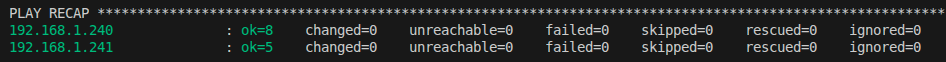
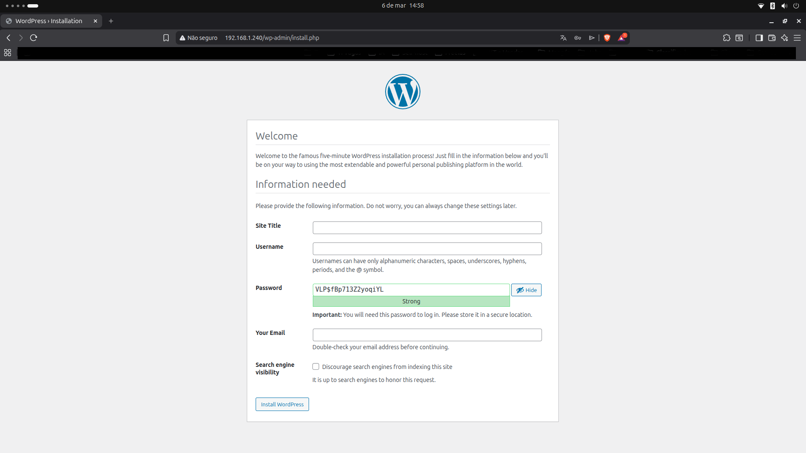

# 🚀 Ansible WordPress Deployment

Projeto de **Infraestrutura como Código (IaC)** utilizando **Ansible** para provisionar automaticamente um ambiente WordPress em servidores Linux.

Este projeto demonstra automação de infraestrutura utilizando **Ansible Playbooks, Roles e Templates**, aplicando boas práticas de organização e separação de serviços.

---

# 📌 Objetivo do projeto

Automatizar a configuração completa de um ambiente WordPress utilizando Ansible, incluindo:

- Instalação e configuração do Apache
- Instalação e configuração do MySQL
- Instalação do PHP e dependências
- Deploy automatizado do WordPress
- Configuração de VirtualHost
- Separação de serviços entre servidores

---

# 🧱 Arquitetura da infraestrutura

A infraestrutura deste projeto é composta por **dois servidores Linux**, separados por função.

### Servidor Web

Responsável por hospedar a aplicação:

- Apache
- PHP
- WordPress

### Servidor de Banco de Dados

Responsável pelo armazenamento de dados:

- MySQL

---

## Arquitetura simplificada

```
           Ansible Control Node
                    │
                    ▼
        ┌────────────────────┐
        │ Web Server         │
        │ Apache + WordPress │
        │ PHP                │
        └─────────┬──────────┘
                  │ MySQL connection
                  ▼
        ┌────────────────────┐
        │ Database Server    │
        │ MySQL              │
        └────────────────────┘
```

O **Ansible Control Node** executa os playbooks e configura remotamente os servidores através de **SSH**.

A separação entre servidor web e banco de dados segue boas práticas de arquitetura, permitindo:

- maior segurança
- isolamento de serviços
- maior escalabilidade da aplicação

---

# 📷 Demonstração

### Execução do playbook Ansible

Resultado da execução do playbook com deploy automatizado da infraestrutura.



---

### WordPress rodando após deploy

Interface do WordPress funcionando após configuração automática realizada pelo Ansible.



---

# ⚙️ Fluxo de execução do playbook

Ao executar o playbook principal, o Ansible realiza as seguintes etapas:

1. Provisiona o **servidor de banco de dados**
2. Instala e configura o **MySQL**
3. Cria o banco de dados e usuário do WordPress
4. Provisiona o **servidor web**
5. Instala **Apache e PHP**
6. Faz download e instalação do **WordPress**
7. Configura o **VirtualHost do Apache**
8. Conecta o WordPress ao banco de dados remoto

---

# 📂 Estrutura do projeto

```
.
├── screenshots
│   ├── ansible-play-recap.png
│   └── wordpress-running.png
├── group_vars
│   ├── all.example.yml
│   ├── mysql.yml
│   └── wordpress.yml
├── roles
│   ├── apache
│   │   └── tasks
│   │       └── main.yml
│   ├── mysql
│   │   ├── handlers
│   │   │   └── main.yml
│   │   └── tasks
│   │       └── main.yml
│   └── wordpress
│       ├── handlers
│       │   └── main.yml
│       ├── meta
│       │   └── main.yml
│       └── tasks
│           └── main.yml
├── templates
│   └── wordpress.conf.j2
├── hosts
├── playbook.yml
└── README.md
```

### Descrição

**roles/**  
Organização modular das tarefas do Ansible.

**group_vars/**  
Variáveis utilizadas na configuração dos servidores.

**templates/**  
Templates Jinja2 utilizados para gerar arquivos de configuração dinamicamente.

**hosts**  
Arquivo de inventário contendo os servidores gerenciados pelo Ansible.

**playbook.yml**  
Playbook principal responsável por executar toda a automação.

---

# ⚙️ Tecnologias utilizadas

- Linux
- Ansible
- Apache
- MySQL
- PHP
- WordPress
- SSH
- Infrastructure as Code (IaC)

---

# ▶️ Como executar o projeto

## 1️⃣ Instalar Ansible

Ubuntu / Debian

```
sudo apt update
sudo apt install ansible -y
```

---

## 2️⃣ Configurar o inventário

Editar o arquivo `hosts`.

Exemplo:

```
[wordpress]
webserver ansible_host=IP_DO_SERVIDOR_WEB ansible_user=ubuntu

[mysql]
dbserver ansible_host=IP_DO_SERVIDOR_DB ansible_user=ubuntu
```

---

## 3️⃣ Configurar variáveis

Foi incluído um arquivo de exemplo:

```
group_vars/all.example.yml
```

Crie o arquivo real baseado nele:

```
cp group_vars/all.example.yml group_vars/all.yml
```

---

## 4️⃣ Executar o playbook

```
ansible-playbook -i hosts playbook.yml
```

O Ansible irá automaticamente:

- instalar Apache
- instalar PHP
- instalar MySQL
- criar banco de dados
- instalar WordPress
- configurar VirtualHost
- conectar WordPress ao banco remoto

---

# 🔐 Segurança

Arquivos contendo **dados sensíveis**, como senhas ou credenciais, foram removidos do repositório.

Para execução do projeto, utilize o arquivo:

```
group_vars/all.example.yml
```

Criando sua própria versão local com as credenciais necessárias.

---

# 🎯 Conceitos demonstrados

Este projeto demonstra conhecimentos em:

- Automação de infraestrutura com Ansible
- Organização de projetos utilizando **Roles**
- Separação de serviços em múltiplos servidores
- Uso de **templates Jinja2**
- Configuração automatizada de aplicações
- Infrastructure as Code
- Deploy automatizado de aplicações web

---

# 👨‍💻 Autor

**Israel Kunn**

Estudante de **DevOps, Linux e Infraestrutura como Código**, focado em automação de ambientes e provisionamento de infraestrutura.
